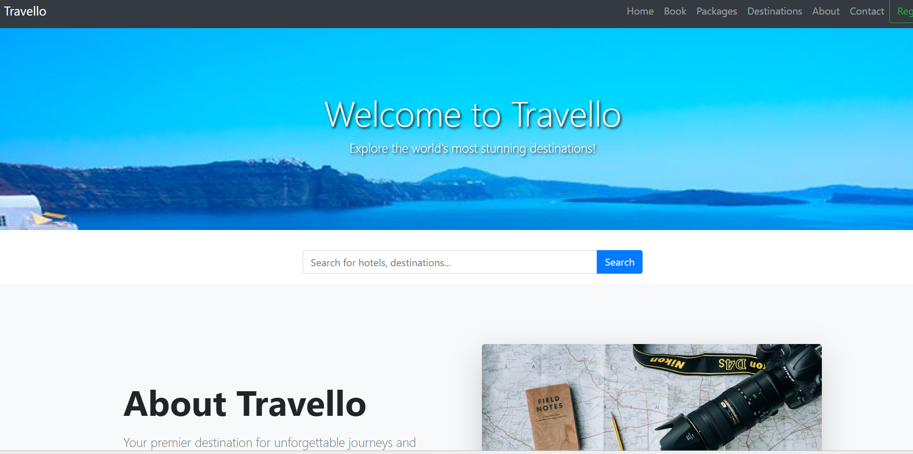

# Travello - Main Version
### Responsive Travel Website Using HTML & CSS

**Travello** is a static travel-themed website developed using **HTML5 and CSS3**.  
The project focuses on clean UI design, responsive layout, and beginner-friendly front-end structure.  
It is suitable for **portfolio showcasing**, **practice**, and **basic web design learning**.

This project was developed as a **front-end practice website**  
using core **HTML and CSS** concepts.

## For live View (click here)

https://bristi41.github.io/travello__00/

---

## 🎯 Project Motivation

Travel websites require attractive design, clear layout, and responsive structure.  
The motivation behind this project was to practice **modern web layout techniques**,  
improve **CSS styling skills**, and understand how real-world travel websites are structured.

This project helps in:
- Improving HTML structure knowledge
- Practicing CSS layout and styling
- Learning responsive design basics

---

## website

##✨ Features

- 🌐 Travel-themed modern UI
- 📱 Responsive design (desktop & mobile)
- 🧭 Navigation bar with sections
- 🖼️ Destination showcase
- 🎨 Clean and simple layout
- ⚡ Fast loading (no frameworks)

---

## 🛠️ Technologies Used

### Frontend

- HTML5
- CSS3

---

## 🏗️ Website Structure

- **Home Page**
- **About Section**
- **Destinations Section**
- **Services Section**
- **Contact Section**

---

## 📋 Project Objectives

- Build a complete static website using HTML & CSS
- Practice responsive layout techniques
- Improve UI/UX design sense
- Create a portfolio-ready web project

---

## ⚙️ How to Run the Project
